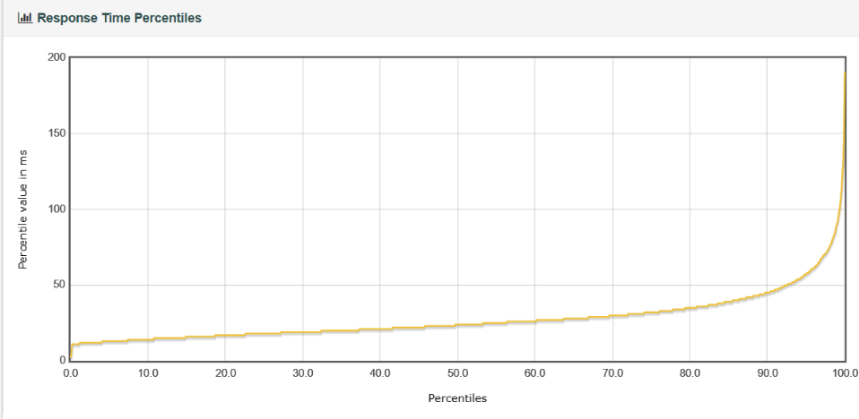
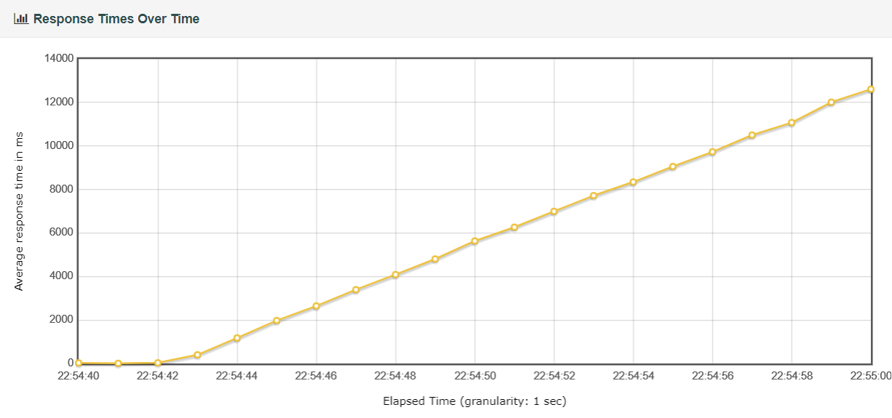
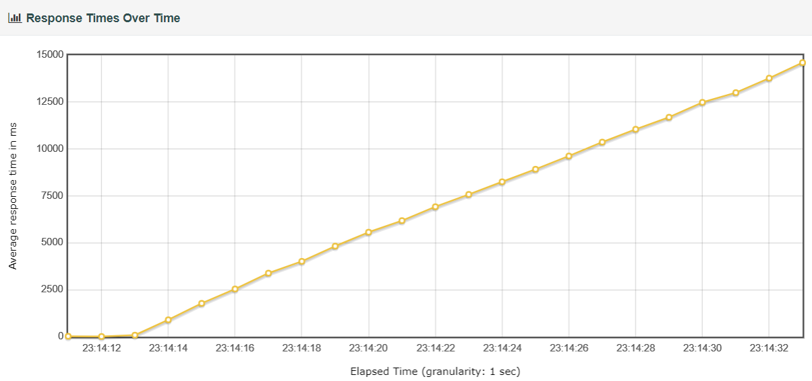

# JavaEE-Experiment

***

## Structure：

* Note：实验笔记

* Result：实验结果的一系列报表

* src：实验中用到的脚本代码

* jtl：jtl源文件

---

以下是实验报告：

# 实验一：MySQL的索引

## 实验目的

* 掌握MyBatis

* 掌握用SpringBoot应用Dao层的实现方法

* 掌握MySQL的索引在读写两方面的效率

## 实验环境

* 节点：华东-上海

**工作机：**

* 操作系统：Ubuntu 22.04

* MySQL：8.2.0

* JDK：17

**测试机：**

* 操作系统：Ubuntu 22.04

* jmeter：5.6.2

* JDK：17

## 实验内容

MySQL的索引对于读写的效率都存在影响，通过实验探究索引对于读操作的影响，以及索引对于写操作的影响。

### 读

#### 预期结果

本次实验中会测量服务器能在**稳定响应**客户端请求的前提下，能接受的线程上限。

在MySQL数据库中，索引对于查询操作的效率理应有较大的提升，所以服务器能先接受的线程上限也会有较大提升。

#### 决定数据

##### 稳定响应时间：

> 稳定响应时间取服务器最后2s的响应时间的众数，**小于40ms**才视为正常。

无索引：

|           | 稳定响应时间 |
| --------- |:------:|
| 1500-10   | 8      |
| 1600-10   | 350    |
| 12700-100 | 40     |
| 12800-100 | 46     |

有索引：

|           | 稳定响应时间 |
| --------- |:------:|
| 1600-10   | 40     |
| 1700-10   | 50     |
| 18300-100 | 35     |
| 18400-100 | 9134   |

##### 关键数据截图：

1. 无索引
   
   **1500-10：**
   
   
   
   
   
   **1600-10：**
   
    
   
   
   
   **12700-100**：
   
   
   
   
   
   **12800-100：**
   
   
   
   

2. 有索引
   
   **1600-10**：
   
   
   
   
   
   **1700-10**：
   
   
   
   
   
   **18300-100：**
   
   
   
   
   
   **18400-100：**
   
   
   
   

#### 决定数据

#### 结果分析与结论

1. 无索引时服务器平均每秒可稳定处理127个查询请求

2. 有索引时服务器平均每秒可稳定处理183个查询请求

3. 索引对查询效率的提升大概在44%左右

### 写

#### 预期结果

本次实验中会测量服务器能在**稳定响应**客户端请求的前提下，能接受的线程上限。

在MySQL数据库中，由于插入时会引起索引的B+树结构变化，所以索引会降低插入操作的效率，所以服务器能先接受的线程上限会下降。

#### 决定数据

##### 稳定响应时间（ms）：

|         | w/o index | w/ 5 indices | w/ all indices |
| ------- |:---------:|:------------:|:--------------:|
| 4000-10 | 8         | 9            | 9              |
| 4001-10 | 13310     | 9013         | 11286          |

##### 实验结果截图：

**无索引：**

1. 4000-10
   
   
   
   

2. 4001-10
   
   
   
   
   
   

**5个索引：**

1. 4000-10
   
   
   
   
   
   

2. 4001-10
   
   
   
   
   
   

**全部索引：**

1. 4000-10
   
   
   
   
   
   

2. 4001-10
   
   
   
   
   
   

#### 结果分析与结论

* 由于MySQL在插入数据时会先根据主键进行查询，而主键上是自带索引的，因此无论加不加索引，服务器的性能上限都是平均每秒400个请求
  
  > 可能是由于测试机出网带宽的限制，导致服务器性能不能每秒超过400个请求。
  > 
  > 
  > 
  > 

## Appendix

1. 实验程序的git地址： www.github.com/impAcreat/JavaEE-Experiment

2. 实验原始数据（JMeter的jtl文件）也位于上述地址。
